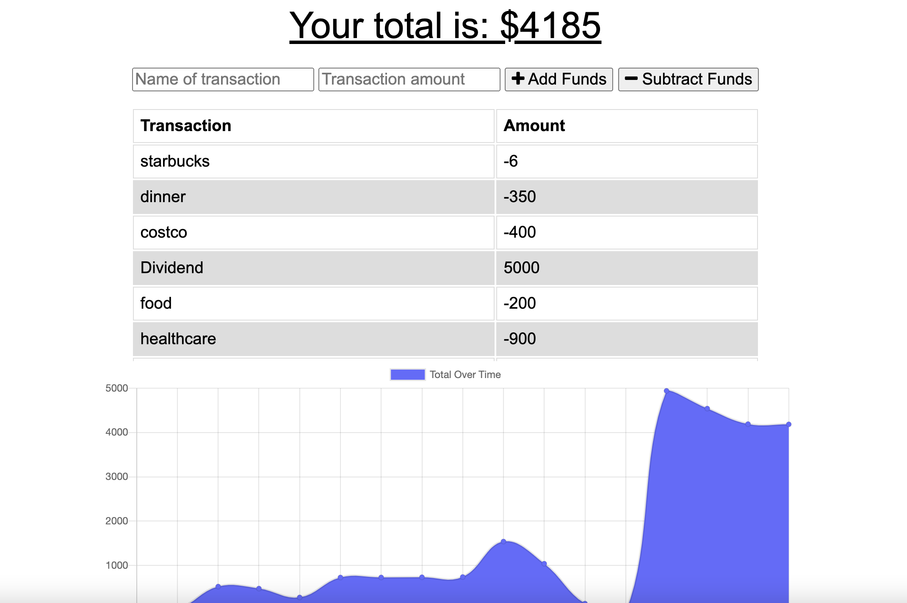

# Budget_Trackers

Unit 18 PWA Homework: Online/Offline Budget Trackers

[]()

## Table of Contents

- [ Description ](#des)
- [ User Story ](#us)
- [ Business Context ](#bc)
- [ Installation](#ins)
- [ Demonstration ](#demo)
- [ Deployed Link](#link)
- [ Tech Used](#tech)
- [ Questions](#q)

## Description <a name="des"></a>

This is an Budget Tracker application to allow for offline access and functionality.

## User Story <a name="us"></a>

```
AS AN avid traveller
I WANT to be able to track my withdrawals and deposits with or without a data/internet connection
SO THAT my account balance is accurate when I am traveling
```

## Business Context <a name="bc"></a>

```
Giving users a fast and easy way to track their money is important, but allowing them to access that information anytime is even more important. Having offline functionality is paramount to our applications success.
```

## Demonstration <a name="demo"></a>



## Deployed Link <a name="link"></a>

The project is deployed to Heroku and available for view :
<>

## Tech Used <a name="tech"></a>

<p>
    
    
    
    
    
</p>

## Questions <a name="q"></a>

- create an issue : <https://github.com/lk9988/Budget_Trackers/issues>
